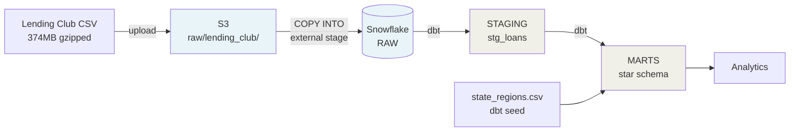
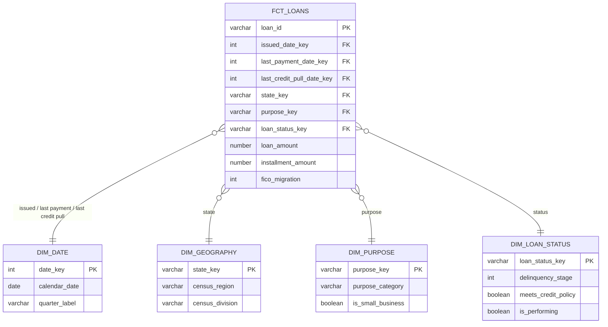

# credit-stream

An end-to-end lending risk and payment monitoring platform on Snowflake and dbt.

Loan-level data lands in S3, is loaded into Snowflake through an IAM-scoped external
stage, and is modeled by dbt into a tested star schema built for **portfolio
monitoring** — identifying accounts that are deteriorating before they become
delinquent.

**Source data:** Lending Club accepted loans, 2007–2018Q4. 2,260,668 loans,
151 raw columns.

---

## Architecture



**Authentication** is delegated end to end. Snowflake holds no AWS credentials — it
assumes an IAM role via STS, gated by an external ID. dbt holds no Snowflake password
— it signs with an RSA private key. No secret is stored anywhere in this repository.

---

## Data Model



| Table | Grain | Rows |
|---|---|---|
| `fct_loans` | one row per loan | 2,260,668 |
| `dim_date` | one row per calendar day | 7,670 |
| `dim_geography` | one row per US state | 51 |
| `dim_purpose` | one row per loan purpose | 14 |
| `dim_loan_status` | one row per (status, policy flag) | 9 |

### There is no borrower dimension

`member_id` is 100% null in this dataset — Lending Club strips it before publishing.
Two loans cannot be linked to the same person, so **the loan is the atomic entity**.

Everything that looks like a borrower attribute — income, employment length, home
ownership — is a snapshot from one application form, not a property of a person
trackable over time. That is documented on the fact table so nothing downstream
mistakes it for customer-level data.

Inventing a borrower dimension would have produced a schema that lies about its own
grain.

---

## Tool Choices & Tradeoffs

**External stage rather than loading through Python.** The raw file stays in S3 as an
immutable record, ingestion is decoupled from compute, and Snowflake parallelizes the
load itself instead of being bottlenecked by a client.

**Storage integration rather than credentials in the stage.** Snowflake stores no
access key — it assumes an IAM role via STS and receives credentials that expire in
about an hour. The external ID in the trust policy prevents the confused-deputy
problem, since Snowflake serves many customers from one AWS principal.

**Key pair rather than password for dbt.** Snowflake is phasing out single-factor
password authentication, and more practically, a CI runner cannot type an MFA code.
Key pair is the only mechanism that works for automation.

**dbt Fusion (2.0) rather than dbt-core 1.x.** Fusion is the default install as of
2026 and its static analysis validates column references against the real warehouse
schema at compile time — a typo surfaces in seconds rather than after a five-minute
run. Tradeoff: it is a preview build. The fallback to dbt-core was cheap, and the
package ecosystem was verified working before committing to it.

**Raw layer is entirely VARCHAR.** A load can never fail on a type mismatch. Casting
is the staging layer's job; raw's contract is "exactly what the source said."

**The source file was not split for parallel loading.** Snowflake parallelizes by
file and gzip decompresses sequentially, so a single 374MB `.gz` loads on one thread —
scaling the warehouse would not have helped. Splitting it would have cost ~30 minutes
of work with real risk of a chunk boundary landing mid-row inside a free-text field,
to save roughly ten minutes once on a historical backfill. For a recurring pipeline the
target would be 100–250MB compressed per file.

**Not every low-cardinality column became a dimension.** The test is not "is
cardinality low" but "does this table carry information the fact does not already
have."

- `dim_geography` — **built.** Adds Census region and division, a rollup level the
  source lacks.
- `dim_loan_status` — **built.** An ordinal delinquency stage enables roll-rate
  analysis and range filters like `delinquency_stage >= 2`.
- `dim_purpose` — **built.** Debt consolidation and credit card are economically the
  same behavior and together are 79% of the book; a category rollup makes the
  breakdown usable.
- `dim_loan_grade` — **built, then dropped.** Splitting `A1` into grade `A` is
  `left(sub_grade, 1)`. That is a substring, not a dimension. Grade and sub-grade are
  degenerate columns on the fact, alongside home ownership, verification status, and
  application type.

**Surrogate keys only where the natural key fails.** `dim_geography` joins on
`state_code` directly — `CA` is already unique and readable inside the fact.
`dim_loan_status` needs a surrogate, because after splitting policy status the natural
key is two columns and "Fully Paid" appears twice.

**`dim_date` is generated as a full daily calendar**, not derived from loan issue
dates. Loans were issued monthly, but payment events land on arbitrary days — a
dimension serving only one fact table is a lookup table with delusions.

---

## Data Quality

**The source contained 33 rows that were not loans.**

Lending Club appends a summary footer to each quarterly CSV
(`Total amount funded in policy code 2: 81866225`). Concatenating the quarterly files
carried the footers in as data. They land with the footer text in the `id` column and
every other field null.

The load reported 2,260,701 rows parsed, 2,260,701 loaded, zero rejected. Every cast
succeeded. Every model built. **Nothing errored.** The rows inflated counts and shifted
every average over a nullable column.

They are filtered in staging — not in raw, which stays as the immutable record of what
the source said — using `try_cast(id as number) is not null`. That encodes the grain
definition rather than a symptom: filtering on the null amount would drop a real loan
that happened to lack one, and matching the footer string would break silently if the
wording changed.

The fix is permanent as `unique` and `not_null` tests on the key.

**One source column encoded two independent facts.**
`Does not meet the credit policy. Status:Charged Off` is a status *plus* a policy
exception. Left intact, `where loan_status = 'Charged Off'` would silently miss 761
loans. It is split in staging into `loan_status` and `meets_credit_policy`.

---

## Testing

Every model carries a contract enforced on each build:
**54 tests across 6 models, 1 source, and 1 seed.**

- **Grain tests** — `unique` + `not_null` on every key
- **Referential integrity** — `relationships` tests on all six foreign keys, including
  the three role-playing date keys
- **Domain constraints** — `accepted_values` encoding real knowledge: Lending Club
  only issued 36- and 60-month terms, grades run A through G
- **Tripwires** — `not_null` on `delinquency_stage` and `purpose_category` catches any
  new source value that falls through a mapping and would otherwise land silently in a
  mart

Deliberately untested: `employment_length_years` is null for ~6.5% of loans where the
borrower did not report it. A `not_null` test there would fail on correctly-handled
data and train people to ignore failures.

---

## Running It

**Prerequisites:** a Snowflake account, an AWS account with an S3 bucket, and
[dbt Fusion](https://docs.getdbt.com/docs/fusion/install-fusion).

```bash
# 1. Snowflake infrastructure - storage integration, stage, file format, raw table
#    Run the scripts in snowflake/ in numerical order.
#    01_setup.sql creates the storage integration; DESC INTEGRATION returns the
#    values needed for the AWS IAM trust policy.

# 2. Register your RSA public key for dbt authentication
#    openssl genrsa 2048 | openssl pkcs8 -topk8 -inform PEM -out ~/.snowflake/rsa_key.p8 -nocrypt
#    openssl rsa -in ~/.snowflake/rsa_key.p8 -pubout -out ~/.snowflake/rsa_key.pub
#    ALTER USER <you> SET RSA_PUBLIC_KEY = '<key material, no PEM wrapper>';

# 3. Configure ~/.dbt/profiles.yml with private_key_path (see dbt/README notes)

# 4. Build
cd dbt
dbt deps
dbt build
```

**Source data:** Lending Club accepted loans from
[Kaggle](https://www.kaggle.com/datasets/wordsforthewise/lending-club). Upload the
accepted loans file to `s3://<your-bucket>/raw/lending_club/`. The data is not
included in this repository.

---

## Repository Layout

```
credit-stream/
├── snowflake/          # infrastructure DDL, numbered in run order
│   ├── 01_setup.sql            # storage integration, database, stage
│   ├── 02_create_raw_table.sql # 151-column DDL, generated from the file header
│   ├── 03_file_format.sql      # CSV parsing rules
│   ├── 04_load_accepted_loans.sql
│   └── 05_validate_load.sql
├── dbt/
│   ├── models/staging/         # stg_loans - typed, cleaned, one row per source row
│   ├── models/marts/           # star schema
│   └── seeds/                  # state_regions.csv
└── CONCEPTS.md         # working notes
```

---

## Roadmap

Not yet built. Listed for shape, not claimed as done.

- **CI/CD** — GitHub Actions running `dbt build` and `sqlfluff` on every pull request
- **Payment event stream** — a generator seeded from real loan outcomes, so loans that
  actually charged off receive deteriorating payment patterns
- **Snowflake Streams + Tasks** — incremental processing of payment events.
  Incremental materialization belongs here rather than on `fct_loans`: the loan
  source is a static historical file that will never receive another row, so an
  incremental model there would never actually run incrementally.
- **Anomaly view** — the signal is not "multiple payments in a cycle," which is
  ambiguous; it is **multiple payments summing to less than the required installment.**
  Someone paying $180 twice against a $400 obligation is failing to meet it. Someone
  paying $400 twice is managing utilization. The installment amount lives in the batch
  layer and the payment events in the stream, so neither source answers it alone.
- **Streamlit dashboard** over the marts
- **RBAC** — dedicated roles replacing ACCOUNTADMIN

---

## Known Limitations

- **The payment stream will be simulated.** Real payment-level transaction data is not
  publicly available — it is PII and financially sensitive. The stream demonstrates the
  detection architecture; it cannot validate that these signals predict default. That
  would require real data.
- **`fico_at_last_pull` leaks the label for predictive modeling.** For charged-off
  loans the last credit pull happened after the default. It is valid for portfolio
  monitoring — "which accounts show score deterioration" — and invalid for training a
  default model.
- **25 of 151 source columns are promoted to staging.** The remaining ~120 credit
  bureau attributes stay in raw, available if a future model needs them. Promoting all
  151 would be noise.
- **Everything runs as `ACCOUNTADMIN`.** Fine for a single-developer project, wrong for
  anything shared.
- **`employment_length_years` maps `'< 1 year'` to 0.** Both that and `'10+ years'` are
  bucket boundaries, not measurements, so averaging tenure is biased slightly low.
